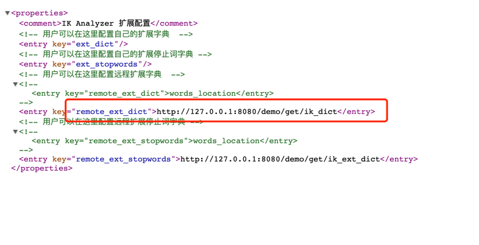
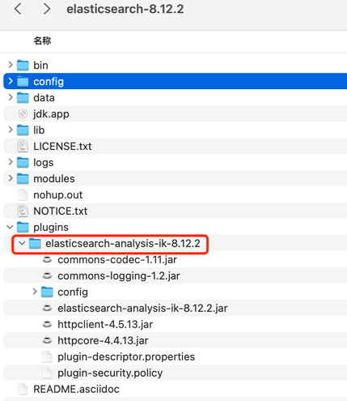

<h2>Springboot3.2.4 集成 ElasticSearch,shardingsphere-jdbc。</h2>
<h1>JDK 是17，如果你的版本低于17，把springboot的版本改成2.5以下就行。</h1>
<h2>还实现了 自定义注解，拦截器</h2>
<h3>集成 ElasticSearch,实现了ik分词库，维护自己的词库等。</h3>


需要下载es相同版本的ik



```
创建t_order_1、t_order_2、t_order_3 三个表。

create table t_order_1
(
    id          bigint auto_increment
        primary key,
    order_name  varchar(250)     not null comment 'order_name',
    price       bigint default 0 not null comment 'price',
    create_time timestamp        null comment 'time',
    update_time datetime         null comment 'time'
);
 

```

如果不想用分库分表，也可以把这部分配置注释掉,放出spring.datasource，就是一个普通的springboot项目了。。
```agsl

# 配置 DataSource Driver
spring.datasource.driver-class-name=org.apache.shardingsphere.driver.ShardingSphereDriver
# 指定 YAML 配置文件
spring.datasource.url=jdbc:shardingsphere:classpath:ShardingSphereDataSource.yaml
```
